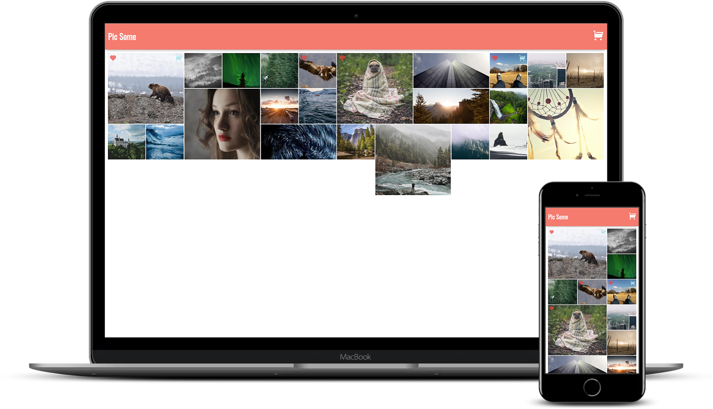

<!--
*** Thanks for checking out this README Template. If you have a suggestion that would
*** make this better, please fork the repo and create a pull request or simply open
*** an issue with the tag "enhancement".
*** Thanks again! Now go create something AMAZING! :D
-->

<!-- PROJECT SHIELDS -->
<!--
*** I'm using markdown "reference style" links for readability.
*** Reference links are enclosed in brackets [ ] instead of parentheses ( ).
*** See the bottom of this document for the declaration of the reference variables
*** for contributors-url, forks-url, etc. This is an optional, concise syntax you may use.
*** https://www.markdownguide.org/basic-syntax/#reference-style-links
-->
[![Contributors][contributors-shield]][contributors-url]
[![Forks][forks-shield]][forks-url]
[![Stargazers][stars-shield]][stars-url]
[![Issues][issues-shield]][issues-url]


<!-- PROJECT LOGO -->
<br />
<p align="center">
  <a href="https://github.com/rammazzoti2000/pic-some">
    
  </a>

  <h3 align="center">Advanced ReactJs --> [PicSome App]</h3>

  <p align="center">
    This project is part of the Scrimba Frontend Developer Career path curriculum!
    <br />
    <a href="https://github.com/rammazzoti2000/pic-some"><strong>Explore the docs »</strong></a>
    <br />
    <br />
    <a href="https://github.com/rammazzoti2000/pic-some/issues">Report Bug</a>
    ·
    <a href="https://github.com/rammazzoti2000/pic-some/issues">Request Feature</a>
  </p>
</p>

<!-- TABLE OF CONTENTS -->
## Table of Contents

* [About the Project](#about-the-project)
  * [Built With](#built-with)
  * [Usage](#usage)
  * [Automated Test](#automated-test)
* [Contributors](#contributors)
* [Acknowledgements](#acknowledgements)
* [License](#license)

<!-- ABOUT THE PROJECT -->
## About The Project
The project I built is a small mock ecommerce website. The idea is for someone to visit the website, look at the images available and choose some of them to have them, theoretically, printed and shipped. The images can be favorited and they can also be added to the cart, then over in the Cart page, the user can see a list of the images he chose. The items can also be removed from the cart in case the user decides he doesn't want them anymore. Also the Cart page displays a grand total of what the prints are going to cost. When the user has decided to place the order he can click the Place Order button, which for now is simulating the order by waiting 3 seconds and empties the cart once the order is completed.
From a technical point of view, to build this project I made use of React Routers, React Hooks and Custom Hooks, Context and Proptypes, which all combined allowed me to build it entirely with functional components.

###
  


### Built With
This project was built using these technologies.
* HTML/CSS
* ReactJs
* React Router
* PropTypes
* React Hooks and Custom Hooks
* React Context
* Heroku Buildpack
* npm
* ES6
* Node.js
* ESLint
* StyleLint
* GithubActions :muscle:
* Atom :atom:

<!-- INSTALLATION -->
## Usage

To have this app on your pc, you need to:
* [download](https://github.com/rammazzoti2000/pic-some/archive/develop.zip) or clone this repo:
  - Clone with SSH:
  ```
    git@github.com:rammazzoti2000//pic-some.git
  ```
  - Clone with HTTPS
  ```
    https://github.com/rammazzoti2000/pic-some.git
  ```

* In the project directory, you can run:

  - `$ npm install` - installs all the dependencies required by the project

  - `$ npm start` - runs the app in the development mode:
    - Open [http://localhost:3000](http://localhost:3000) to view it in the browser.
    - The page will reload if you make edits.
    - You will also see any lint errors in the console.

  - `$ npm run build`
    - Builds the app for production to the `build` folder.
    - It correctly bundles React in production mode and optimizes the build for the best performance.
    - The build is minified and the filenames include the hashes.
    - Your app is ready to be deployed!

## Automated Test
 > to be added

## Live Demo & Deployment
The project has been deployed with [Heroku Buildpack for create-react-app](https://github.com/mars/create-react-app-buildpack#user-content-requires)

[Heroku Live Demo Link](https://pic-somejsx.herokuapp.com/) :point_left:

<!-- CONTACT -->
## Contributors

👤 **Alexandru Bangau**

- LinkedIn: [Alexandru Bangau](https://www.linkedin.com/in/alexandru-bangau/)
- GitHub: [@rammazzoti2000](https://github.com/rammazzoti2000)
- E-mail: bangau.alexandru@gmail.com

## :handshake: Contributing

Contributions, issues and feature requests are welcome!

Feel free to check the [issues page](https://github.com/rammazzoti2000/pic-some/issues).

## Show your support

Give a :star: if you like this project!

<!-- ACKNOWLEDGEMENTS -->
## Acknowledgements
* [Scrimba](https://www.scrimba.com/)
* Image attributions - [PicSum](https://picsum.photos/)
* [Unsplash](https://unsplash.com/)
* Icon Library - [RemixIcon](https://remixicon.com/)
* [React Documentation](https://reactjs.org/docs/getting-started.html)
* [Heroku Documentation](https://devcenter.heroku.com/)
* [Heroku Buildpack](https://github.com/mars/create-react-app-buildpack#user-content-requires)

<!-- MARKDOWN LINKS & IMAGES -->
<!-- https://www.markdownguide.org/basic-syntax/#reference-style-links -->
[contributors-shield]: https://img.shields.io/github/contributors/rammazzoti2000/pic-some.svg?style=flat-square
[contributors-url]: https://github.com/rammazzoti2000/pic-some/graphs/contributors
[forks-shield]: https://img.shields.io/github/forks/rammazzoti2000/pic-some.svg?style=flat-square
[forks-url]: https://github.com/rammazzoti2000/pic-some/network/members
[stars-shield]: https://img.shields.io/github/stars/rammazzoti2000/pic-some.svg?style=flat-square
[stars-url]: https://github.com/rammazzoti2000/pic-some/stargazers
[issues-shield]: https://img.shields.io/github/issues/rammazzoti2000/pic-some.svg?style=flat-square
[issues-url]: https://github.com/rammazzoti2000/pic-some/issues

## 📝 License

This project is [MIT](https://opensource.org/licenses/MIT) licensed.
